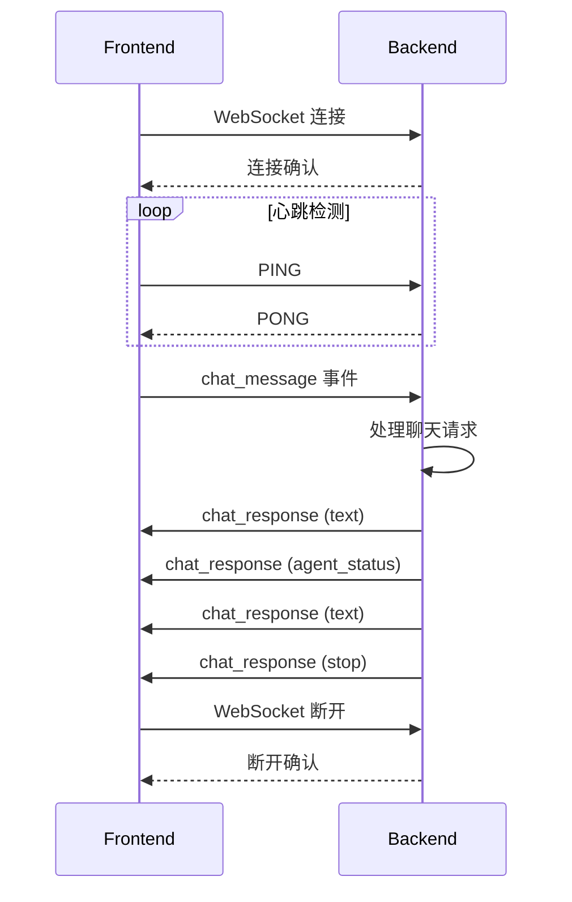

# WebSocket 通信方案

## 目标
将当前基于 SSE 的聊天通信机制迁移到 WebSocket，实现：
- 客户端和服务器之间的双向通信
- 服务器工作流状态的实时通知
- 持久连接和心跳机制确保连接稳定性

## 技术选型
- **后端**: Flask-SocketIO（与现有 Flask 应用集成）
- **前端**: socket.io-client（与 Flask-SocketIO 兼容）

## 实施步骤

### 后端改造
1. 安装依赖：
   ```bash
   pip install flask-socketio
   ```

2. 在 [`backend/app.py`](backend/app.py) 中集成 SocketIO：
   ```python
   from flask_socketio import SocketIO, emit
   socketio = SocketIO(app, cors_allowed_origins="*")
   ```

3. 创建 WebSocket 消息处理函数：
   ```python
   @socketio.on('chat_message')
   def handle_chat_message(data):
       try:
           history = data.get('history', [])
           current_text = data.get('current_text', '')
           current_image_paths = data.get('current_image_paths', [])
           
           # 调用聊天处理逻辑
           process_chat(history, current_text, current_image_paths)
       except Exception as e:
           emit('error', {'message': f'处理失败: {str(e)}'})
   ```

4. 修改聊天处理函数使用 WebSocket 发送消息：
   ```python
   def send_text_msg_ws(text: str):
       emit('chat_response', {
           "type": "text",
           "content": {"data": text}
       })
   
   def send_agent_status_ws(status: str, message: str):
       emit('chat_response', {
           "type": "agent_status",
           "content": {"status": status, "message": message}
       })
   ```

### 前端改造
1. 安装依赖：
   ```bash
   npm install socket.io-client
   ```

2. 在 [`frontend-react/src/hooks/useWebSocket.js`](frontend-react/src/hooks/useWebSocket.js) 创建 WebSocket hook：
   ```javascript
   import { useEffect, useState } from 'react';
   import io from 'socket.io-client';
   
   export default function useWebSocket() {
     const [socket, setSocket] = useState(null);
     
     useEffect(() => {
       const newSocket = io('http://localhost:7222');
       setSocket(newSocket);
       
       return () => newSocket.disconnect();
     }, []);
     
     return socket;
   }
   ```

3. 修改 [`frontend-react/src/components/ChatContainer.jsx`](frontend-react/src/components/ChatContainer.jsx)：
   ```javascript
   // 导入 hook
   import useWebSocket from '../hooks/useWebSocket';
   
   // 在组件中使用
   const socket = useWebSocket();
   
   // 修改 handleSend 函数
   const handleSend = (type, val) => {
     if (type === 'text' && val.trim()) {
       // ...准备消息...
       socket.emit('chat_message', {
         history: messages,
         current_text: val,
         current_image_paths: imageUrls
       });
     }
   }
   
   // 添加消息监听
   useEffect(() => {
     if (!socket) return;
     
     socket.on('chat_response', (data) => {
       switch(data.type) {
         case 'text':
           appendMsg({type: 'text', content: {text: data.content.data}});
           break;
         case 'agent_status':
           appendMsg({type: 'text', content: {text: data.content.message}});
           break;
         case 'stop':
           // 处理停止逻辑
           break;
       }
     });
   }, [socket]);
   ```

## 消息格式
```json
{
  "type": "text | agent_status | stop | error",
  "content": {
    // 根据类型有不同的字段
  }
}
```

## 连接维护
- Flask-SocketIO 内置心跳机制（默认间隔25秒）
- 客户端自动发送 PING，服务器响应 PONG
- 连接断开时自动尝试重连

## 通信流程图


## 错误处理
- 服务器异常时发送 error 类型消息
- 客户端监听 error 事件并显示给用户
- 网络断开时自动尝试重新连接